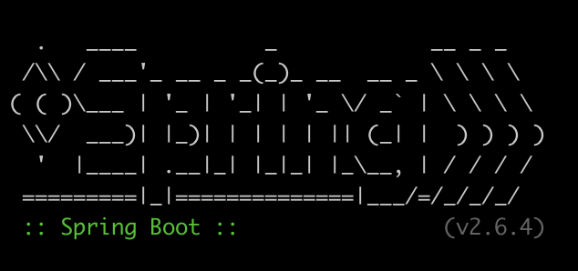

# Projet Simple Calculateur Java - HETIC

MT4 - Module Java - Travaux pratiques



## Table of Contents

- [Set up](#setup)
- [Usage](#usage)
- [Author](#author)

## Exercice 11

In the branch `exercice-1` :

1. Run the following command to compile code:

   ```bash
   cd learning-spring
   mvn install
   ```

2. Run the following command to package class

   ```bash
   mvn package
   ```

3. Run the following command to test the calculator :

   ```bash
   java -jar target/exercice11-1.0-SNAPSHOT.jar
   ```

## Author

- Benoît FAVRIE ([@benoitfvr](https://github.com/benoitfvr))<br />
